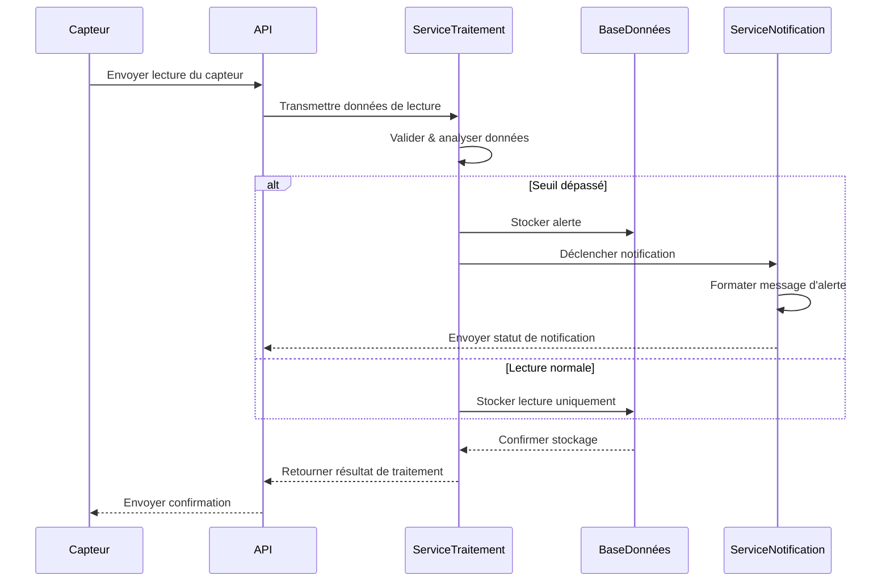

# Architecture pour {Titre du PRD}

Statut : { Brouillon | Approuvé }

## Résumé technique

{ Bref paragraphe de 1-2 phrases }

## Table des technologies

Tableau répertoriant les choix de langages, bibliothèques, infrastructure, ressources cloud, etc... peut ajouter plus de détails ou de raffinements par rapport à ce qui figurait dans le PRD

<exemple>
  | Technologie | Version | Description |
  | ---------- | ------- | ----------- |
  | Kubernetes | x.y.z | Plateforme d'orchestration de conteneurs pour le déploiement de microservices |
  | Apache Kafka | x.y.z | Plateforme de streaming d'événements pour l'ingestion de données en temps réel |
  | TimescaleDB | x.y.z | Base de données temporelle pour le stockage des données de capteurs |
  | Go | x.y.z | Langage principal pour les services de traitement de données |
  | GoRilla Mux | x.y.z | Framework d'API REST |
  | Python | x.y.z | Utilisé pour l'analyse de données et les services ML |
  | DeepSeek LLM | R3 | API hébergée localement via Ollama et API hébergée à distance pour l'engagement conversationnel client |
</exemple>

## **Vue d'ensemble de haut niveau**

Définir le style architectural (par exemple, Monolithe, Microservices, Serverless) et justifier le choix en fonction du PRD. Inclure un diagramme de haut niveau (par exemple, niveau C4 Contexte ou Conteneur en utilisant la syntaxe Mermaid).

### **Vue des composants**

Identifier les principaux composants/modules/services logiques, décrire leurs responsabilités et les interactions/API clés entre eux. Inclure des diagrammes si utile (par exemple, diagrammes C4 Conteneur/Composant ou diagrammes de classes en utilisant la syntaxe Mermaid).

## Diagrammes d'architecture, modèles de données, schémas

{ Diagrammes Mermaid pour l'architecture }
{ Modèles de données, spécifications d'API, schémas }

<exemple>

### Conception Dynamo One Table pour la table App

```json
{
  "TableName": "AppTable",
  "KeySchema": [
    { "AttributeName": "PK", "KeyType": "HASH" },
    { "AttributeName": "SK", "KeyType": "RANGE" }
  ],
  "AttributeDefinitions": [
    { "AttributeName": "PK", "AttributeType": "S" },
    { "AttributeName": "SK", "AttributeType": "S" },
    { "AttributeName": "GSI1PK", "AttributeType": "S" },
    { "AttributeName": "GSI1SK", "AttributeType": "S" }
  ],
  "GlobalSecondaryIndexes": [
    {
      "IndexName": "GSI1",
      "KeySchema": [
        { "AttributeName": "GSI1PK", "KeyType": "HASH" },
        { "AttributeName": "GSI1SK", "KeyType": "RANGE" }
      ],
      "Projection": { "ProjectionType": "ALL" }
    }
  ],
  "EntityExamples": [
    {
      "PK": "USER#123",
      "SK": "PROFILE",
      "GSI1PK": "USER",
      "GSI1SK": "John Doe",
      "email": "john@example.com",
      "createdAt": "2023-05-01T12:00:00Z"
    },
    {
      "PK": "USER#123",
      "SK": "ORDER#456",
      "GSI1PK": "ORDER",
      "GSI1SK": "2023-05-15T09:30:00Z",
      "total": 129.99,
      "status": "shipped"
    },
    {
      "PK": "PRODUCT#789",
      "SK": "DETAILS",
      "GSI1PK": "PRODUCT",
      "GSI1SK": "Wireless Headphones",
      "price": 79.99,
      "inventory": 42
    }
  ]
}
```

### Diagramme de séquence pour l'enregistrement des alertes



### Schéma de lecture du capteur

```json
{
  "sensor_id": "string",
  "timestamp": "datetime",
  "readings": {
    "temperature": "float",
    "pressure": "float",
    "humidity": "float"
  },
  "metadata": {
    "location": "string",
    "calibration_date": "datetime"
  }
}
```

</exemple>

## Structure du projet

{ Diagramme de l'organisation des dossiers et fichiers avec descriptions }

```
├ /src
├── /services
│   ├── /gateway        # Ingestion de données des capteurs
│   ├── /processor      # Traitement et validation des données
│   ├── /analytics      # Analyse de données et ML
│   └── /notifier       # Système d'alerte et de notification
├── /deploy
│   ├── /kubernetes     # Manifestes K8s
│   └── /terraform      # Infrastructure as Code
└── /docs
    ├── /api           # Documentation API
    └── /schemas       # Schémas de données
```

## Exigences de test et framework

### Modèles et standards (opiniâtres et spécifiques)

    - **Modèles architecturaux/de conception :** Imposer des modèles spécifiques à utiliser (par exemple, Pattern Repository pour l'accès aux données, MVC/MVVM pour la structure, CQRS si applicable).

    - **Standards de conception d'API :** Définir le style d'API (par exemple, REST, GraphQL), les conventions clés (nommage, stratégie de versionnage, méthode d'authentification) et les formats de données (par exemple, JSON).

    - **Standards de codage :** Spécifier le guide de style obligatoire (par exemple, Guide de style JavaScript Airbnb, PEP 8), le formateur de code (par exemple, Prettier) et le linter (par exemple, ESLint avec une configuration spécifique). Définir les conventions de nommage obligatoires (fichiers, variables, classes). Définir les conventions d'emplacement des fichiers de test.

    - **Stratégie de gestion des erreurs :** Décrire l'approche standard pour la journalisation des erreurs, la propagation des exceptions et le formatage des réponses d'erreur.

### Configuration initiale du projet (étapes manuelles)

Définir l'histoire 0 : Indiquer explicitement les tâches de configuration initiales pour l'utilisateur. Développer ce qui était dans le PRD s'il était déjà présent mais insuffisant, sinon simplement le répéter. Exemples :

- Génération de CLI de framework : Spécifier la commande exacte (par exemple, `npx create-next-app@latest...`, `ng new...`). Justifier pourquoi le manuel est préféré.
- Configuration de l'environnement : Création manuelle de fichier de configuration, configuration de variables d'environnement. S'inscrire pour un compte de base de données Cloud.
- LLM : Configurer un LLM local ou s'inscrire pour une clé API si utilisation à distance

## Infrastructure et déploiement

{ comptes cloud et ressources que nous devrons provisionner et à quelle fin }
{ Spécifier l'environnement de déploiement cible (par exemple, Vercel, AWS EC2, Google Cloud Run) et décrire la stratégie CI/CD et les outils spécifiques envisagés. }

## Journal des modifications

{ tableau des modifications }
